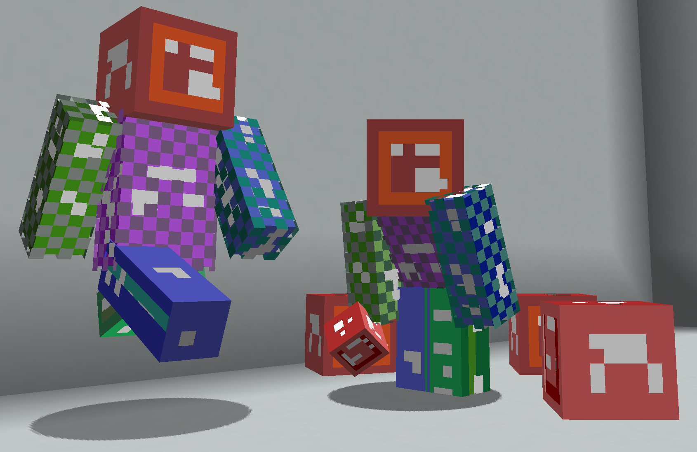

# Stable Player Display
models + shaders to display player models using new item_display entites. 

**This shader is stable on death, relog, unload, placed skulls, etc. The shader is not spawn order dependent.**

 

## caveats
- use on item_display only
- limited support for translucent skins (will dither instead)
- do not modify Rotation[1] nbt (pitch)
- model can not be loaded >512 meters **vertical distance** from player (unlimited horizontal range)
- if using transformation.transtation[1] for animations, subtract required y offset

## usage

```
/summon minecraft:item_display ~ ~1.4 ~ {Tags:["head"],item_display:"thirdperson_righthand",view_range:0.6f,transformation:{translation:[0.0f,0.0f,0.0f],left_rotation:[0.0f,0.0f,0.0f,1.0f],scale:[1.0f,1.0f,1.0f],right_rotation:[0.0f,0.0f,0.0f,1.0f]}}
/summon minecraft:item_display ~ ~1.4 ~ {Tags:["arm_r"],item_display:"thirdperson_righthand",view_range:0.6f,transformation:{translation:[0.0f,-1024.0f,0.0f],left_rotation:[0.0f,0.0f,0.0f,1.0f],scale:[1.0f,1.0f,1.0f],right_rotation:[0.0f,0.0f,0.0f,1.0f]}}
/summon minecraft:item_display ~ ~1.4 ~ {Tags:["arm_l"],item_display:"thirdperson_righthand",view_range:0.6f,transformation:{translation:[0.0f,-2048.0f,0.0f],left_rotation:[0.0f,0.0f,0.0f,1.0f],scale:[1.0f,1.0f,1.0f],right_rotation:[0.0f,0.0f,0.0f,1.0f]}}
/summon minecraft:item_display ~ ~1.4 ~ {Tags:["torso"],item_display:"thirdperson_righthand",view_range:0.6f,transformation:{translation:[0.0f,-3072.0f,0.0f],left_rotation:[0.0f,0.0f,0.0f,1.0f],scale:[1.0f,1.0f,1.0f],right_rotation:[0.0f,0.0f,0.0f,1.0f]}}
/summon minecraft:item_display ~ ~0.7 ~ {Tags:["leg_r"],item_display:"thirdperson_righthand",view_range:0.6f,transformation:{translation:[0.0f,-4096.0f,0.0f],left_rotation:[0.0f,0.0f,0.0f,1.0f],scale:[1.0f,1.0f,1.0f],right_rotation:[0.0f,0.0f,0.0f,1.0f]}}
/summon minecraft:item_display ~ ~0.7 ~ {Tags:["leg_l"],item_display:"thirdperson_righthand",view_range:0.6f,transformation:{translation:[0.0f,-5120.0f,0.0f],left_rotation:[0.0f,0.0f,0.0f,1.0f],scale:[1.0f,1.0f,1.0f],right_rotation:[0.0f,0.0f,0.0f,1.0f]}}
/item replace entity @e[tag=head] hotbar.0 with minecraft:player_head{SkullOwner:"Notch",CustomModelData:1}
/item replace entity @e[tag=arm_r] hotbar.0 with minecraft:player_head{SkullOwner:"Notch",CustomModelData:2}
/item replace entity @e[tag=arm_l] hotbar.0 with minecraft:player_head{SkullOwner:"Notch",CustomModelData:3}
/item replace entity @e[tag=torso] hotbar.0 with minecraft:player_head{SkullOwner:"Notch",CustomModelData:4}
/item replace entity @e[tag=leg_r] hotbar.0 with minecraft:player_head{SkullOwner:"Notch",CustomModelData:5}
/item replace entity @e[tag=leg_l] hotbar.0 with minecraft:player_head{SkullOwner:"Notch",CustomModelData:6}
```

- `view_range:0.6f` guarantees the player model will be unloaded within 512 blocks vertically
- `translation:` skin is loaded based on y offset:

  0 = head

  -1024 = right arm
  
  -2048 = left arm
  
  -3072 = torso
  
  -4096 = right leg
  
  -5120 = left leg
  
- `~ ~1.4 ~ ` when standing, head arms and torso pivot from here
- `~ ~0.7 ~`  when standing, legs pivot from here
- `SkullOwner:` player skin to load
- `CustomModelData:` each body part has its own custom model:

  1 = head
  
  2 = right arm
  
  3 = left arm
  
  4 = torso
  
  5 = right leg
  
  6 = left leg

  7 = slim right arm

  8 = slim left arm

## compatibility with Animated Java
**Last tested with AJ 0.4.2**. Since this resource pack operates purely on a y offset, converting existing Animated Java animations to use Stable Player Display is rather simple. Just add a corresponding y offset to each transformation. See contents of `animated-java-resources`.

**Warning! AJ supports Rotation[1] nbt (pitch) but Stable Player Display does not! Do not summon AJ rigs with Rotation[1]! Use a command block to be safe!**

1. Create player animation using rig similar to `player_anim.ajmodel` 
   - **bone dimension and name should not be changed!**
   -  Pivot should remain consistent! If they are changed in AJ, update them in the Stable Player Display model as well
   -  Item for player in AJ does not matter, it can be discarded later
   -  Model generated with AJ 0.4.2
2. Export animation to a dummy resource pack (**not stable player display**) and datapack
3. Run `aj-convert.py` in datapack root folder
   - **only run this script once per AJ export!**
   - requires `python3`
   - requires `nbtlib` https://pypi.org/project/nbtlib/
   - usage: `aj-convert.py [project] [optional:flags]`
```
available flags:
        -ns=[namespace]         internal project namespace. Default 'zzzzzzzz'
        -pn=[playerName]        player skin to use. Default '' no skin, must be set later in game
        -s                      slim model. Default disabled
```
4. Delete AJ resource pack if no other assets needed
   - AJ generated player assets are not needed since Stable Player Display is being used instead
5. Use the provided loot tables (slim available as well) to update the AJ model in game:
```
/loot replace entity @e[tag=aj.player_anim.bone.head] hotbar.0 loot player_anim:player/head
/loot replace entity @e[tag=aj.player_anim.bone.right_arm] hotbar.0 loot player_anim:player/right_arm
/loot replace entity @e[tag=aj.player_anim.bone.left_arm] hotbar.0 loot player_anim:player/left_arm
/loot replace entity @e[tag=aj.player_anim.bone.torso] hotbar.0 loot player_anim:player/torso
/loot replace entity @e[tag=aj.player_anim.bone.right_leg] hotbar.0 loot player_anim:player/right_leg
/loot replace entity @e[tag=aj.player_anim.bone.left_leg] hotbar.0 loot player_anim:player/left_leg
```

## how it works

This shader makes use of item_displays not culling when the displayed model is out of player view. The translation can be set to a high value `n, 2n, 3n ...` to signal the shader. As long as the player is within `n/2` vertical distance of the item_display, the shader will be able to correctly identify the intended texture UVs to load.
  
## credits

**Resonance#3633** - providing custom models and base template

**https://github.com/sireroo** - mild inspiration
