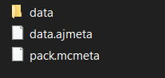
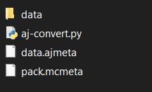

# Stable Player Display

This repository contains models and shaders to display any player skin using only a resource pack and display entities.

## Limitations

- Use only with `item_display` entities.
- **Do NOT modify the Rotation[1]** NBT (pitch) of any bone in the model.
- The model cannot be loaded from more than 512 meters **vertical distance** from the player (unlimited horizontal range).
- If using `transformation.translation[1]` for animations, subtract the required y-offset (if you are using AJ, the script handles this).
- Will only be updated for **Minecraft Vanilla**, if it breaks in a modded client, you are out of luck.

## Use Modes

### Raw Item Displays

If you want to manually summon item displays, use the following commands (it is recommended to use a function):

```
summon minecraft:item_display ~ ~1.4 ~ {Tags:["head"],item_display:"thirdperson_righthand",view_range:0.6f,transformation:{translation:[0.0f,0.0f,0.0f],left_rotation:[0.0f,0.0f,0.0f,1.0f],scale:[1.0f,1.0f,1.0f],right_rotation:[0.0f,0.0f,0.0f,1.0f]}}
summon minecraft:item_display ~0.25 ~1.4 ~ {Tags:["arm_r"],item_display:"thirdperson_righthand",view_range:0.6f,transformation:{translation:[0.0f,-1024.0f,0.0f],left_rotation:[0.0f,0.0f,0.0f,1.0f],scale:[1.0f,1.0f,1.0f],right_rotation:[0.0f,0.0f,0.0f,1.0f]}}
summon minecraft:item_display ~-0.25 ~1.4 ~ {Tags:["arm_l"],item_display:"thirdperson_righthand",view_range:0.6f,transformation:{translation:[0.0f,-2048.0f,0.0f],left_rotation:[0.0f,0.0f,0.0f,1.0f],scale:[1.0f,1.0f,1.0f],right_rotation:[0.0f,0.0f,0.0f,1.0f]}}
summon minecraft:item_display ~ ~1.4 ~ {Tags:["torso"],item_display:"thirdperson_righthand",view_range:0.6f,transformation:{translation:[0.0f,-3072.0f,0.0f],left_rotation:[0.0f,0.0f,0.0f,1.0f],scale:[1.0f,1.0f,1.0f],right_rotation:[0.0f,0.0f,0.0f,1.0f]}}
summon minecraft:item_display ~0.125 ~0.7 ~ {Tags:["leg_r"],item_display:"thirdperson_righthand",view_range:0.6f,transformation:{translation:[0.0f,-4096.0f,0.0f],left_rotation:[0.0f,0.0f,0.0f,1.0f],scale:[1.0f,1.0f,1.0f],right_rotation:[0.0f,0.0f,0.0f,1.0f]}}
summon minecraft:item_display ~-0.125 ~0.7 ~ {Tags:["leg_l"],item_display:"thirdperson_righthand",view_range:0.6f,transformation:{translation:[0.0f,-5120.0f,0.0f],left_rotation:[0.0f,0.0f,0.0f,1.0f],scale:[1.0f,1.0f,1.0f],right_rotation:[0.0f,0.0f,0.0f,1.0f]}}
```

Then populate the displays:

```
item replace entity @e[tag=head] hotbar.0 with minecraft:player_head[minecraft:item_model="animated_java:blueprint/player_display/head",minecraft:profile="jeb_"]
item replace entity @e[tag=arm_r] hotbar.0 with minecraft:player_head[minecraft:item_model="animated_java:blueprint/player_display/right_arm",minecraft:profile="jeb_"]
item replace entity @e[tag=arm_l] hotbar.0 with minecraft:player_head[minecraft:item_model="animated_java:blueprint/player_display/left_arm",minecraft:profile="jeb_"]
item replace entity @e[tag=torso] hotbar.0 with minecraft:player_head[minecraft:item_model="animated_java:blueprint/player_display/torso",minecraft:profile="jeb_"]
item replace entity @e[tag=leg_r] hotbar.0 with minecraft:player_head[minecraft:item_model="animated_java:blueprint/player_display/right_leg",minecraft:profile="jeb_"]
item replace entity @e[tag=leg_l] hotbar.0 with minecraft:player_head[minecraft:item_model="animated_java:blueprint/player_display/left_leg",minecraft:profile="jeb_"]
```
> **_NOTE:_**  For split models, there are additional `right_forearm`, `left_forearm`, `lower_right_leg`, and `lower_left_leg` models.

Here is a tutorial using the sample_datapack:

https://github.com/user-attachments/assets/648255b9-2317-4c77-b5a4-659bc418a4ef

### Animated Java: Datapack

1. Open [player.ajblueprint](animated-java-resources/player.ajblueprint) with Blockbench.

   1.1. In the project settings, select the Minecraft version that matches your release version.
   *(Use 1.21.5 for versions 1.21.5 to 1.21.8.)*

   1.2. Choose an empty resource pack where we’ll dump the generated files from the plugin.
   We will **not** use these generated files — instead, we’ll use **only** our custom resource pack: [resourcepack](resourcepack/).

   > \[!IMPORTANT]
   > **Do NOT export the AJ project directly into the default resource pack. Use the default RP without any modifications.**

   1.3. Set the datapack path to the world where you want the project to run.

   1.4. Export the project. Your datapack files should look like this:

   

2. Place the script alongside the exported files.

   2.1. Ensure your folder structure looks like this:

   

   2.2. Run the script from the root of the datapack directory:

   * **Only run this script once per AJ export!**
   * Requires `python3`.
   * Requires the `nbtlib` library: [https://pypi.org/project/nbtlib/](https://pypi.org/project/nbtlib/).
   * Usage: `aj-convert.py [aj_project_name] [optional_flags]`

   Available flags:

   * `-pn=[playerName]`: Player skin to use. Default is `''` (no skin); this must be set later in-game.
   * `-split`: Use a player model with extra joints. *(Must be exported using [player\_split.ajblueprint](animated-java-resources/player_split.ajblueprint).)*

3. Load the resource pack in Minecraft.

4. Summon the rig using the [AJ Documentation](https://animated-java.dev/docs/introduction/what-is-animated-java).

   4.1. **Be sure to use `execute rotated ~ 0` when summoning the rig. NEVER modify `Rotation[1]` of the model.**

   4.2. Example summon command:

   ```mcfunction
   execute rotated ~ 0 run function animated_java:[project_name]/summon {args:{variant:"default"}}
   ```

5. Use the provided loot tables (including a slim variant) to update the AJ model in-game.


```
loot replace entity @e[tag=aj.player_anim.bone.head] hotbar.0 loot minecraft:player/head
loot replace entity @e[tag=aj.player_anim.bone.right_arm] hotbar.0 loot minecraft:player/right_arm
loot replace entity @e[tag=aj.player_anim.bone.left_arm] hotbar.0 loot minecraft:player/left_arm
loot replace entity @e[tag=aj.player_anim.bone.torso] hotbar.0 loot minecraft:player/torso
loot replace entity @e[tag=aj.player_anim.bone.right_leg] hotbar.0 loot minecraft:player/right_leg
loot replace entity @e[tag=aj.player_anim.bone.left_leg] hotbar.0 loot minecraft:player/left_leg
```

Here is a step by step tutorial:


https://github.com/user-attachments/assets/a9f9aaac-b3ac-4c86-a81a-4622dfc7c3b4


### Animated Java: Plugin mode

1. Export the player rig from Animated Java with plugin mode enabled
2. When you parsed blueprint, you should change Y translation of rig bones. 
   1. Get current Y translation and subtract from that bone-related offset. (E. g. `headTranslation.y -= headOffset`)
3. Display mode of ItemDisplay must be set to THIRDPERSON_RIGHTHAND.
4. Don't forget to set item_model to appropriate value.

Offsets
```
head         0
right_arm   1024
left_arm    2048
torso       3072
right_leg   4096
left_leg    5120
```

## Split Model
The same mode as Animated Java: Datapack but the model has extra joints. Don't forget to use the flag `-split`.


---

## Update Skin

The [sample_datapack](animated-java-resources/sample_datapack/) provides loot tables to update the skin of the player display.

If you want to specify a skin manually, you can use the following function:

```
/execute as @e[tag=aj.player_display.root] run function player_display:skin/set_skin {name:"Notch"}
```

## Variants

A slim variant is generated when running the Animated Java Python script, and can be summoned just like any other variant.

Custom variants are not automatically processed by the script. If you want to add one, refer to how the "default" and "slim" variants are generated within the datapack. You'll need to modify the `apply.mcfunction` file to reference the appropriate `/zzz/*.mcfunction` files, which are responsible for updating the item model paths. Then, for each `/zzz/*.mcfunction` file, update the references to the desired item model for each body part.

## Issues You Might Encounter

- **Why is my model invisible?**: This is the most possible outcome if you didn't follow the steps correctly. So make sure to check this steps:
   1. You summoned the model withouth `rotated ~ 0`.
   2. You didn't set a model skin, so the game has no skin to display.
   3. You are not using the correct resourcepack version with your minecraft version.
   4. You changed the name paths of the resourcepack or loot tables and now the game can't find the models.
   5. Probably there are more, but this shouldn't be an issue if you followed the steps correctly.

-  There is a tutorial and a step by step explanation on how to setup the model. Confirm your steps before opening any issues.

- **When running the script**: The script includes multiple error checks for possible issues during processing. Please **READ** the messages output by the terminal carefully. Basic issues like `FileNotFoundError: [Errno 2] No such file or directory:` are not bug report worthy. Make sure you are using the script correctly and in the proper directories. (However, if it worked in a previous AJ version but doesn't now, feel free to ask me.)

- **Problems with the resource pack**: The resource pack may break with each new version of Minecraft since shaders are still quite experimental. Make sure to use this repo with the last-supported Minecraft version, and wait for an update if a new version of Minecraft or Animated Java is released.

- **Editing the pivot points of the model**: If you've tried animating the AJ model, you may have found the pivot points inconvenient to work with and attempted to change them, which may have caused the model to distort. To fix this, you need to manually adjust the `translation` for each model part in th resourcepack.

Make sure you have all the necessary libraries installed, export the project correctly, use ONLY the resource pack from this repo, test everything twice, and follow the AJ documentation. 

## How to Submit an Issue

### 1. **Specify the Environment**
   - **Version**: Specify the version of the script and Minecraft you're using.

### 2. **Describe the Problem**
   - **What You Tried to Do**: Clearly explain what you were trying to accomplish.
   - **What Happened**: Describe the unexpected behavior or error.
   - **Expected Outcome**: Mention what you expected to happen instead.
   - **Steps to Reproduce**: List the exact steps to reproduce the issue. This helps me replicate the problem on my side.

### 3. **Include Logs and Screenshots**
   - **Logs**: Provide any relevant error logs or output (use code blocks for clarity).
   - **Screenshots**: Attach screenshots or screen recordings that show the issue.

### 4. **Additional Context**
   - **Other Information**: Add any other information you think might be helpful, such as related issues, workarounds you've tried, or relevant libraries.

Please note, **Help cannot be provided beyond updating the script and the shader**. If you want to add any other functionality, you will need to do it yourself.

---

If you encounter any errors or a new version breaks some aspect of the resource pack or script, feel free to DM on Discord: **erkko_68**.

## Credits

- **Resonance#3633**: Providing custom models and base templates.
- **[sireroo](https://github.com/sireroo)**: Mild inspiration.
- **[bradleyq](https://github.com/bradleyq/stable_player_display/tree/main)**: Original creator.
- **[erkko68](https://github.com/erkko68/stable_player_display)**: updated AJ fork.
---
